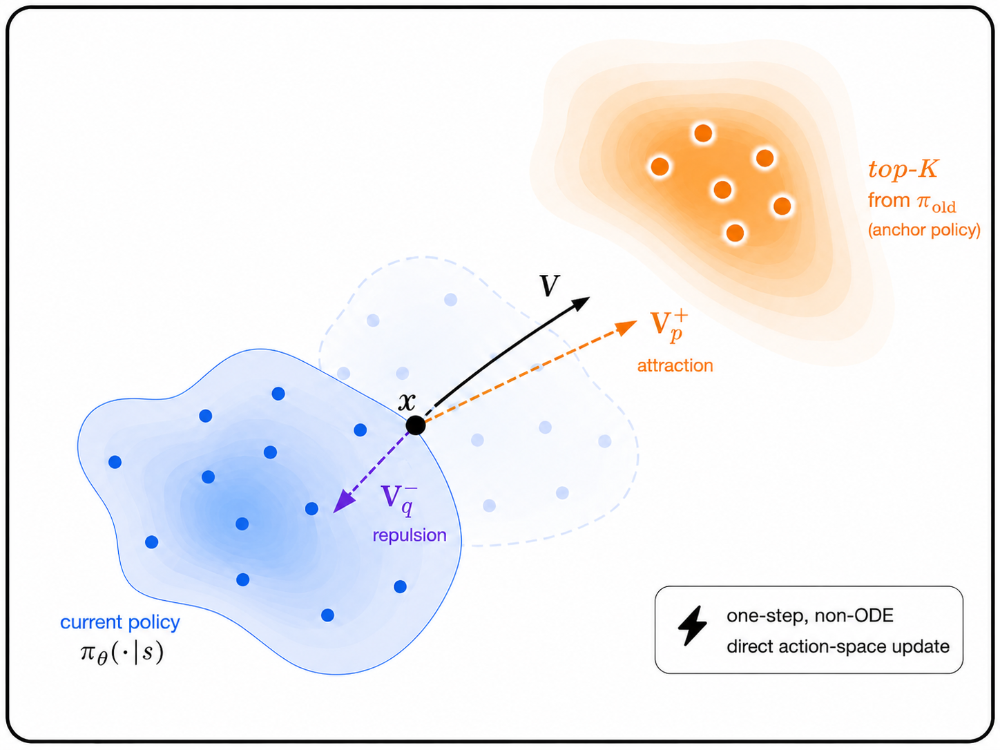

<div align="center">

<h2>Drifting Field Policy: A One-Step Generative Policy via Wasserstein Gradient Flow</h2>

[**Juil Koo**](https://63days.github.io/) · [**Mingue Park**](https://uygnim99.github.io/) · **Jiwon Choi** · [**Yunhong Min**](https://myh4832.github.io/) · [**Minhyuk Sung**](https://mhsung.github.io/)

KAIST

<span style="font-size: 1.5em;"><b>Preprint</b></span>

<br>

<a href="https://arxiv.org/abs/2605.07727"></a>
<a href="https://driftingpolicy.github.io/"></a>

<br><br>

<a href="https://driftingpolicy.github.io/">
  
</a>

</div>

<blockquote align="center">
DFP directly updates a one-step generative policy in action space through a drifting-field objective, avoiding ODE trajectory-level credit assignment during offline-to-online RL fine-tuning.
</blockquote>

## Overview

Drifting Field Policy (DFP) is a non-ODE one-step generative policy for offline-to-online reinforcement learning. DFP represents the policy as a single-pass pushforward map from Gaussian noise to actions, and frames policy improvement as a Wasserstein-2 gradient flow toward the soft policy improvement target.

Because the exact soft target is intractable, DFP uses a practical top-K critic-selected action surrogate: it samples candidate actions from the current policy, selects high-value actions with the critic, and trains the drifting field toward those actions. This keeps inference one-step while directly applying online reward signals at the action level.

This release contains:

- `drift`: Drifting Field Policy.
- `meanflow`: MVP/MeanFlow comparison backbone.
- `acfql`: QC/FQL baseline retained from the original action-chunking codebase.

---

## Environment and Requirements

### Tested Environment

- **Python:** 3.10
- **CUDA:** 12.x
- **Benchmarks:** Robomimic, OGBench

### Installation

```bash
conda create -n dfp python=3.10 -y
conda activate dfp
pip install -r requirements.txt
```

You can also use the provided conda environment file:

```bash
conda env create -f enviromnet_mingue.yml
conda activate <env-name>
```

---

## Datasets

### Robomimic

Place the low-dimensional Robomimic datasets under the standard Robomimic directory:

```text
~/.robomimic/lift/mh/low_dim_v15.hdf5
~/.robomimic/can/mh/low_dim_v15.hdf5
~/.robomimic/square/mh/low_dim_v15.hdf5
```

The datasets can be downloaded from the Robomimic dataset page:
https://robomimic.github.io/docs/datasets/robomimic_v0.1.html

### OGBench Cube-Quadruple

For cube-quadruple, we use the 100M-size offline dataset:

```bash
wget -r -np -nH --cut-dirs=2 -A "*.npz" \
  https://rail.eecs.berkeley.edu/datasets/ogbench/cube-quadruple-play-100m-v0/
```

Pass the downloaded directory with:

```bash
--ogbench_dataset_dir=/path/to/cube-quadruple-play-100m-v0
```

---

## Usage

The main results are offline-to-online runs. Each command first trains on the offline dataset and then continues online fine-tuning in the same run.

```bash
# DFP
MUJOCO_GL=egl python main.py --agent_config=drift --run_group=reproduce --env_name=cube-triple-play-singletask-task2-v0 --sparse=False --horizon_length=5

# MVP
MUJOCO_GL=egl python main.py --agent_config=meanflow --run_group=reproduce --env_name=cube-triple-play-singletask-task2-v0 --sparse=False --horizon_length=5

# QC-BFN
MUJOCO_GL=egl python main.py --run_group=reproduce --agent.actor_type=best-of-n --agent.actor_num_samples=32 --env_name=cube-triple-play-singletask-task2-v0 --sparse=False --horizon_length=5

# QC-FQL
MUJOCO_GL=egl python main.py --run_group=reproduce --agent.alpha=100 --env_name=cube-triple-play-singletask-task2-v0 --sparse=False --horizon_length=5

# BFN
MUJOCO_GL=egl python main.py --run_group=reproduce --agent.actor_type=best-of-n --agent.actor_num_samples=4 --env_name=cube-triple-play-singletask-task2-v0 --sparse=False --horizon_length=1

# FQL
MUJOCO_GL=egl python main.py --run_group=reproduce --agent.alpha=100 --env_name=cube-triple-play-singletask-task2-v0 --sparse=False --horizon_length=1
```

The default agent is `acfql`, so the QC-BFN, QC-FQL, BFN, and FQL commands do not need an explicit `--agent_config=acfql`. Override the environment when needed:

```bash
MUJOCO_GL=egl python main.py \
  --agent_config=drift \
  --run_group=reproduce \
  --env_name=cube-quadruple-play-100m-singletask-task3-v0 \
  --ogbench_dataset_dir=/path/to/cube-quadruple-play-100m-v0 \
  --seed=42
```

### Online-Only From an Offline Checkpoint

To skip offline training and start online fine-tuning from a saved offline checkpoint, pass the checkpoint and set `restore_epoch` to the offline training horizon:

```bash
MUJOCO_GL=egl python main.py \
  --agent_config=drift \
  --run_group=reproduce \
  --env_name=cube-triple-play-singletask-task3-v0 \
  --restore_path=/path/to/params_offline_final.pkl \
  --restore_epoch=1000000 \
  --seed=42
```

---

## Repository Layout

| Path | Description |
|------|-------------|
| `agents/` | DFP, MVP/MeanFlow, and QC/FQL baseline agents |
| `config/` | Main, evaluation, optimizer, and agent configs |
| `envs/` | Robomimic, OGBench, and D4RL environment utilities |
| `utils/` | Datasets, networks, drifting loss, logging, and Flax utilities |

---

## Citation

If you find our work useful, please consider citing:

```bibtex
@article{koo2026drifting,
  title={Drifting Field Policy: A One-Step Generative Policy via Wasserstein Gradient Flow},
  author={Koo, Juil and Park, Mingue and Choi, Jiwon and Min, Yunhong and Sung, Minhyuk},
  journal={arXiv preprint arXiv:2605.07727},
  year={2026}
}
```

---

## Acknowledgements

This repository builds on the Q-chunking/FQL codebase. We retain the `acfql` baseline for compatibility and comparison.
